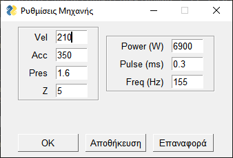

# Thermal absorber parametric drawing generator

## Description
Graphical interface for automatic creation of thermal absorber mechanical 
drawings.

## Usage
The user inserts the required product specifications, the geometric 
properties and materials of a thermal absorber, as well as the laser 
welding machine operating conditions in the respective input fields. The 
main window and the laser operating conditions window are shown below.

<p align="center">
  
  
</p>

The current product naming convention is utilized in order to preselect 
default settings before any other input. The naming convention is as 
follows:

...**FPNXXX**

Where:
 * **XXX**: three numbers,
 * **N**: has one of the following values

| **N** | Settings set        |
| -----:| ------------------- |
|     2 | Material: Selective |
|     3 | Material: TSS       |
|     4 | Material: Coated    |
|     8 | Panel type: Strips,<br>Material: Selective |

For instance by inserting a name ending in "...FP8011" the `Absorber 
type` is automatically set as *Strips* and the `Material` as *Selective*. 
In addition other limitations are automatically set such as the enabling 
of the `Closed exit header length` field when specifying one of the 
closed exits checkboxes or the enabling of `Meander length` when 
specifying the `Absorber type` as *Meander*, or the disabling of the 
*TSS*, *Coated*, and *Copper* `Materials` when selecting a *Strips* 
`Absorber type`. When pressing the `Generate` button value set validity 
checks are performed and warning messages are displayed in case of 
invalid input before generating the drawing.

Also, the laser operating conditions in the fields of the window that 
appears when pressing the button `Machine settings`. When the window is 
first opened a default value set is used depending on the materials 
selected in the main window. These values can be modified and are 
automatically stored in and loaded from a `.dat` file in the current 
directory. With this input is also shown in the final job order contained 
in the generated `.pdf` file along with the drawing.

### Features

 - [x] Automated parametric product drawing generation according to 
   input.
 - [x] Automatic value completion according to naming convention and 
   product type.
 - [x] Information/warning message display.
 - [x] Automatic storing and load of machine settings.

## Installation
 1. Clone this project locally.
 2. Generate the executable bundle by running:

    ``` bash
    python -m PyInstaller -w -F main.py
    ```

    inside the project directory.

### Dependencies

 * [PySimpleGUI](https://github.com/PySimpleGUI/PySimpleGUI)
 * [PyInstaller](https://github.com/pyinstaller/pyinstaller)
 * [Pillow](https://github.com/python-pillow/Pillow)
